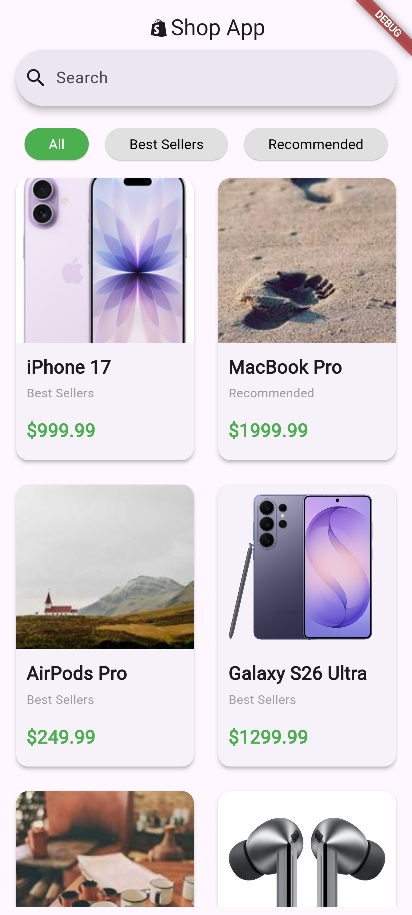
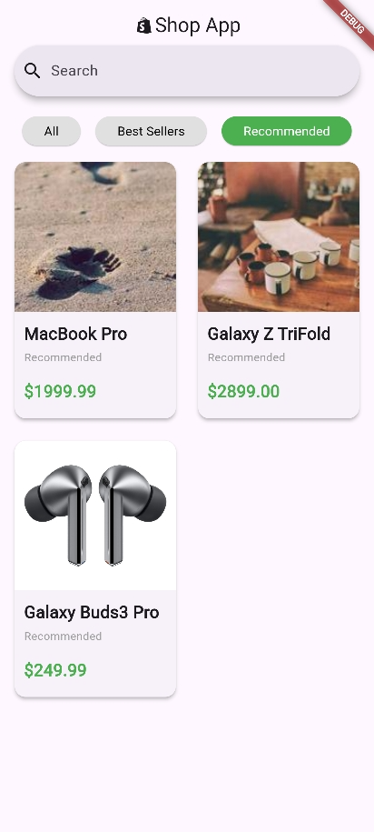
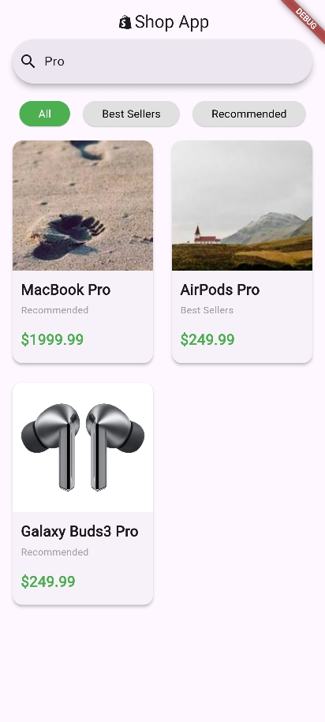

# Shop App

A simple Flutter e-commerce app showcasing products with category filters and search functionality.

---

## Features

- Display products in a grid layout
- Filter products by category: **All**, **Best Sellers**, **Recommended**
- Real-time search by product name
- Responsive `AppBar` with logo and search bar
- Product cards with image, name, price, and category

---

## Screenshots

<table>
  <tr>
    <td width="33%">All</td>
    <td width="5"></td>
    <td width="33%">Filter</td>
    <td width="5"></td>
    <td width="33%">Search</td>
  </tr>
  <tr>
    <td width="33%"></td>
    <td width="5"></td>
    <td width="33%"></td>
    <td width="5"></td>
    <td width="33%"></td>
  </tr>
</table>

---

## Getting Started

### Prerequisites

- Flutter SDK ≥ 3.0
- Dart ≥ 3.0
- Android Studio, VS Code, or any IDE supporting Flutter

### Installation

```bash
git clone https://github.com/nightpetal/FlutterShop.git
cd FlutterShop
flutter pub get
flutter run
```

---

## Project Structure

```bash
lib/
├── data/
│   └── product_data.dart   # JSON data for products
├── screens/
│   └── home.dart           # Home screen (UI + logic)
├── widgets/
│   ├── nav_bar.dart        # AppBar with search bar
│   └── product_card.dart   # Product UI component
└── main.dart               # App entry point
```

---

## Usage

* Type in the search bar to filter products by name
* Tap category buttons to filter products by category
* Both search and category filters can work together

---

## Disclaimer

This project is for educational and demonstration purposes only.
All product names (such as *iPhone*, *MacBook*, *AirPods*, *Galaxy*) and images used are for UI mockup purposes only.
They are **not affiliated with, endorsed by, or associated with Apple Inc. or Samsung Electronics**.

Product images are sourced from placeholder services and are used only to simulate an e-commerce interface.

---

## License

This project is licensed under the [MIT License](https://github.com/nightpetal/FlutterShop/blob/main/LICENSE).
